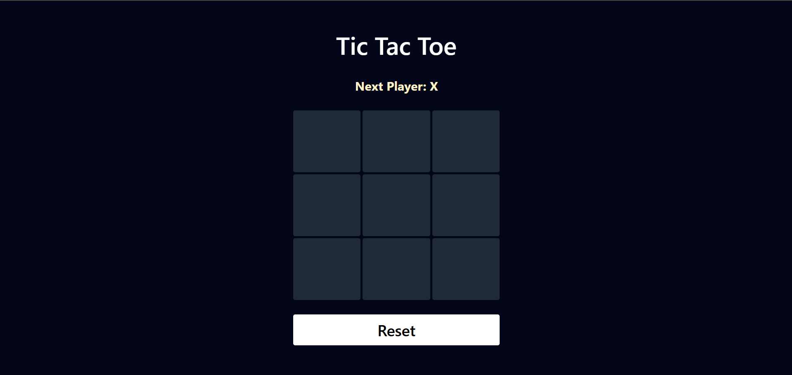
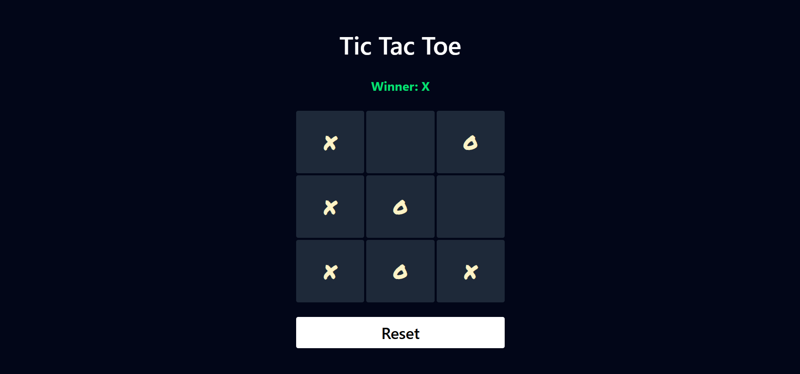
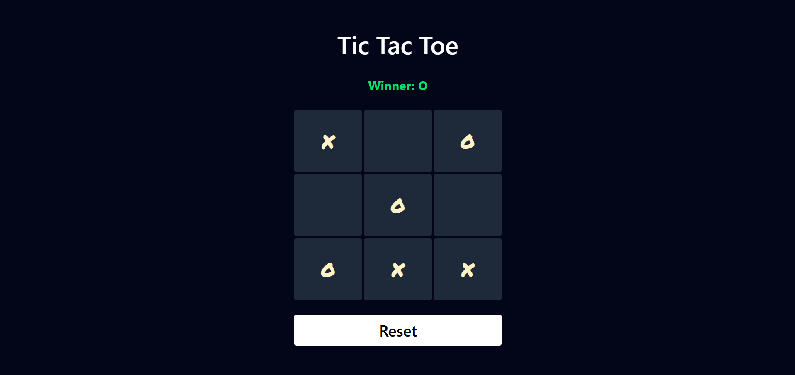
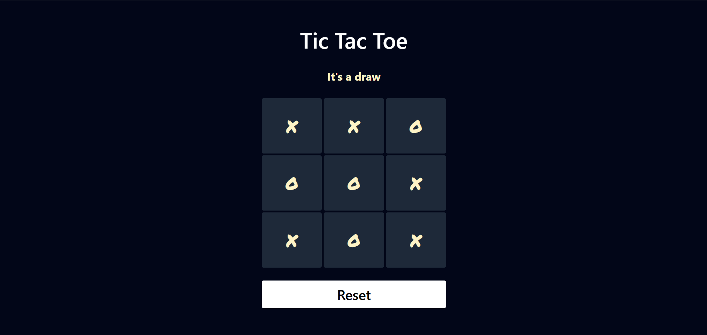

# Tic Tac Toe

A Tic-Tac-Toe game using React.js

---

## Features

- Two users can play against each other
- Displays whose turn it is
- Detects the winner
- Option to restart the game

---

## Screenshots

---

# Live Demo

Try the app live here:
[Tic-Tac-Toe](https://akr-tic-tac-toe.netlify.app/)
